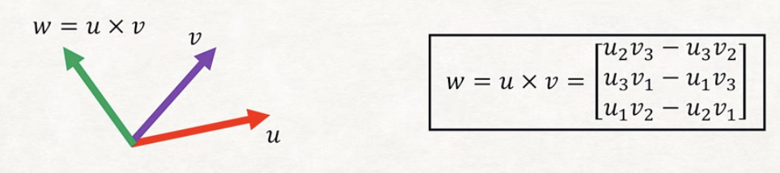

# Linear Algebra
在有限元方法中，需要一定的线性代数的理论基础，在这里只列举了部分相关的知识，做一个简单的回顾。

## Basis and Dimensions 

基和空间，常常我们在研究问题是会通常在一个三维的正交空间中分析。但是遇到特定问题是会出现其他的基空间。

!!! info
    **$\R^2 \rightarrow$ 二维向量空间,   $\R^2 = \{(x,y)|x,y\in \R \}\\$**
    **$\R^3 \rightarrow$ 三维向量空间,  $\R^3 = \{(x,y,z)|x,y,z\in \R \}$**

### Linearly Dependent/Independent

已经学习过了线性代数，我们知道通常使用基向量前的系数代表一个新的向量，此时为了规范的表示这个向量，或者一个向量集合的关系，往往引入一个概念：

对于一个向量集合 ${x_1,x_2,x_3,x_4......x_k}$ 对于一些系数 ${k_1,k_2.....k_n}\in R$:

- 线性相关(dependent)：如果满足其中一个向量能被其他向量表示 $\sum x_ik_i = 0$
- 线性无关(independent):如果不能被其他向量表示$\sum x_ik_i \neq 0$

## Norm Functions
向量或者矩阵的范数(Norm)，代表衡量这个矩阵或者向量大小的标准，对一个向量长度进行量化。在有限元分析时，往往在三维空间，对于一个向量我们需要进行大小衡量。

??? note
    Vector Norm Function 条件：

    - $\|\alpha v\|=|\alpha|\|v\|$
    - $\|u+v\| \leq \|u\| + \|v\|$
    - $\|v\|=0 v=0$

比较常见的范数，二范数(Euclidean Norm) $V = [v_1,v_2,....]^T$ 其范数为 $\|v\| = \sqrt{v_1^2+v_2^2+...}$

### Metric (Distance) Function 度量函数
??? note
    Metric Function 条件：

    - $\rho(u,v) = \rho(v,u)$
    - $\rho(u,w) \leq \rho(u,v) + \rho(v,w)$
    - $\rho(u,v) = 0, u=v$

## Orthonormal Basis
对于一组 模长 为 1，同时彼此互相正交（点乘等于0）的一组基，称为正交基。

## Cross Product
在理解了空间与向量定义之后，向量间会存在一系列的计算与运算符号。
{width="500"}

此时 $\|w\| = A$ ,这 $A$ 为 $v,u$ 围城的平行四边形面积
一些 Properties ：

- 如果两个向量垂直 $w \cdot u =u \cdot w = 0$  
- 如果两个向量平行 $w \times u = 0$
- 叉乘交换顺序需要改变符号 $u \times v = - v \times u$
- 存在结合率  $u \times (v+w) = u \times v + u \times w$
- $(au) \times v = a(u \times v) = u \times (av)$ 

### Triple (Scalar) Product
$u \cdot (v \times w)$ 代表三个向量构成的平行四面体的体积

- $u \cdot (v \times w) = v\cdot (w \times u ) = w \cdot (u \times v) = -u\cdot (w\times v) = \v \cdot (u \times w) = -w \cdot (v \times u)$
- 如果三个向量线性相关  $u \cdot (v \times w) = 0$
- 如果三个向量正交 $u \cdot (v \times w) = \pm 1$

## Change of Basis
这个部分在实际应用中见到比较多，这里是向量不变，但是需要修改一下空间的基向量。
比如对于木质材料，垂直各向异性的材料，沿着木的纹理作为一个基，往往会方便分析许多。
$$
\begin{aligned}
    u^{\prime} &= Q u\\\\
    Q_{ij} &= e_i^{\prime} \cdot e_j
\end{aligned}
$$

## Linear Maps
在之前对于线性代数进行了一个简单的铺垫，此时有一个在有限元方法中比较重要的概念 **线性映射**

??? example
    - 简单的函数映射 $f :\R \rightarrow \R$ :$f(x) = kx$
    - 二维向量映射 $f:\R^2 \rightarrow \R^2$ : $f(x) = \begin{pmatrix}\alpha_{11} & \alpha_{12} \\\\ \alpha_{21} & \alpha_{22}\end{pmatrix} \begin{pmatrix}x_1 \\\\ x_2\end{pmatrix} $

**此时在有限向量空间中的映射 被称为张量 （Tensor）**

!!! success
    在 Euclidean Space 中（默认在有限元中都在此空间研究问题），张量和矩阵是一致的。

## Determinants 行列式

- 判断矩阵的可逆性 (invertibility) :$A^{-1}$

    ??? note
        矩阵的 invertibility ,可逆的矩阵 
        
        1.  $det(A)=0$
        2.  每一个列向量 或者 每一个行向量 是线性相关的
        3.  对于 $Ax=0$ 有无数多个解

- 判断 在一个线性变化后 对应面积的变化 ：向量横纵坐标围成的面积，在经过张量 A 的一次线性变化之后，面积变成原来的 $det(A)$ 倍。

## Eigenvalues and eigenvectors

我认为这个概念是研究中比较重要的一个点，无论是求解问题，还是在之后谱半径。

特征向量和特征根是对于一个矩阵 M 而言，$M\vec x$可以理解为对于 向量 $\vec x$ 的线性变化。通常来说，对向量进行了伸缩旋转。特征向量和特征根便是一种特殊情况。不妨设特征向量 $\vec \phi$ 特征根 $\lambda$ ,狭义特征问题往往满足如下等式：

$$
 M \vec\phi = \lambda \vec\phi
$$

此时，能够清晰的发现，M 对 $\phi$ 完成对线性变化之改变了长度，并没有改变方向，此时长度变化的倍数为 $\lambda$ 这个便是特征问题的集合涵义。

!!! question
    那么特征向量和特征值该如何求解呢？

$$
    M \vec \phi = \lambda \vec\phi \\\\
    (M - \lambda I) \phi = 0
$$

如果存在特征向量，那么上述等式应该存在非0解以外的解，故方程存在无数组解，系数举证可逆（行列式为0）：$\det(M-\lambda I)=0$

## Invariants 一致性
这里考虑的不变性，是矩阵M在基变化之后并不会发生改变。（$M^{\prime} = Q M Q^{-1}$），故 $M = M^{\prime}$

- **First Invaiant Trace** $I_1(M) = Tr(M) = \sum_{i=1}^3M_{ii}$
- **Second Invariant** $I_2(M)=\frac{1}{2}(I_1(M)^2-I_1(MM))$
- **Third Invariant** $I_3(M)=det(M)$

## Orthogonal Tensors 正交张量

$$
 Q^T Q = I
$$

满足上述代数式的矩阵就称为 正交张量。 可以观察得出矩阵$Q$的每一行或者每一列都是正交的单位向量。

$$
\det(Q) = \pm 1
$$

## Symmetric Tensors

对称张量在有限元方法中是十分常用的，比如说应力张量和应变张量都是对称张量。

$$
S = S^T
$$

!!! info "如下的一些性质就比较重要了"
    - $Sa\cdot b = a \cdot Sb$
    ??? note "Provement"
        $Sa \cdot b = (Sa)^T b = a^T Sb= a\cdot Sb$
    - $S$ 和 $S^{\prime} = QSQ^T$ 都是对称张量
    !!! danger "重要的一条性质"
        对于一个 $n \times n$的张量，其有 $n$ 个特征值，并且有 $n$ 个正交特征向量：
        Provement：不妨设 $\vec v,\vec w$ 是两组不同的特征向量，此时$\mu,\lambda$ 分别是对应的特征值。

        $Sw = \lambda w$ 两边同乘一个 $v^T$ 此时会有 $v^TSw=v^T\lambda w = \lambda v^T w$

        这里如果结合一下 $v^TSw=(Sv)^Tw=\mu v^Tw$

        所以 $\lambda v^T w = \mu v^T w$ 但是对于两个不同特征值，那么只能满足 $v \cdot w = 0$ 故特征向量正交

